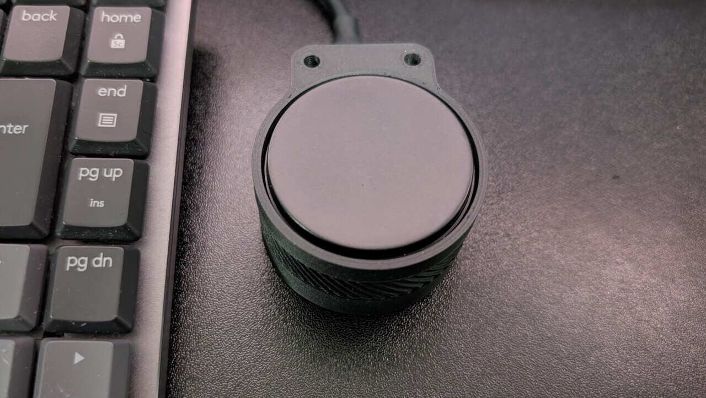
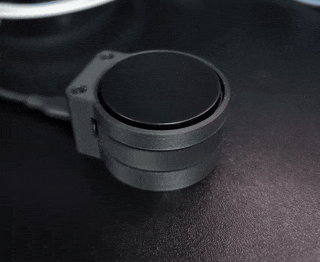
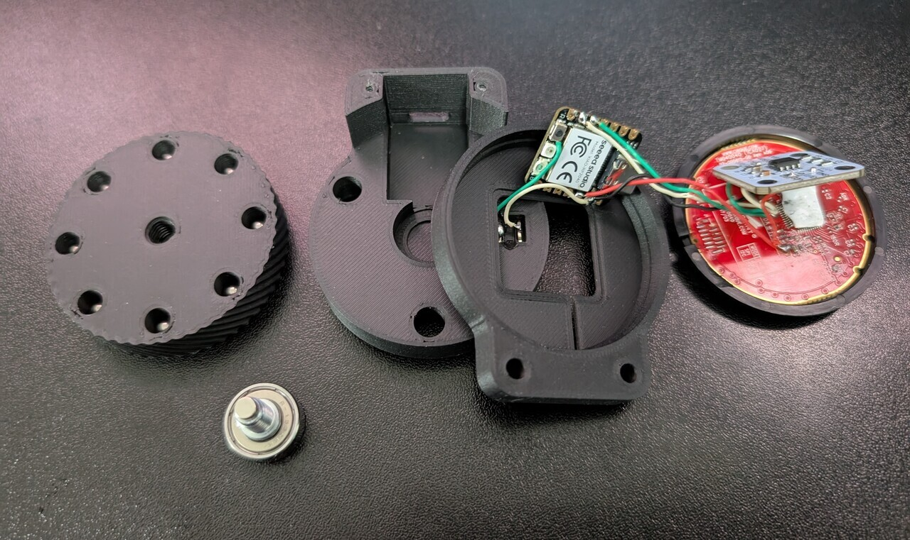
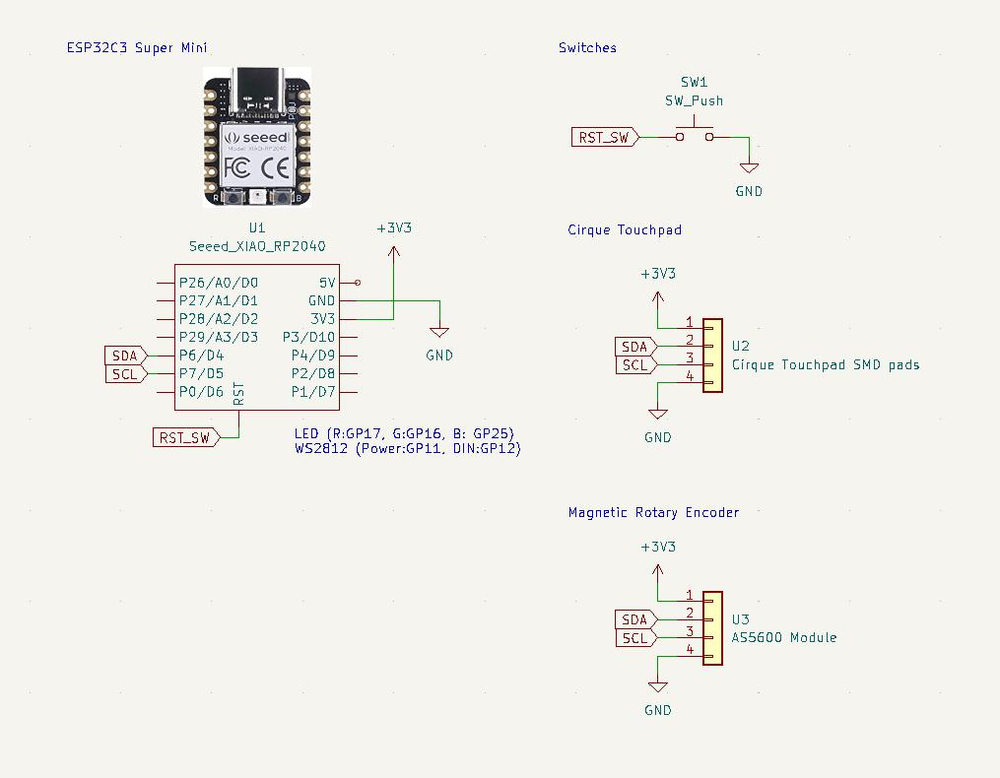
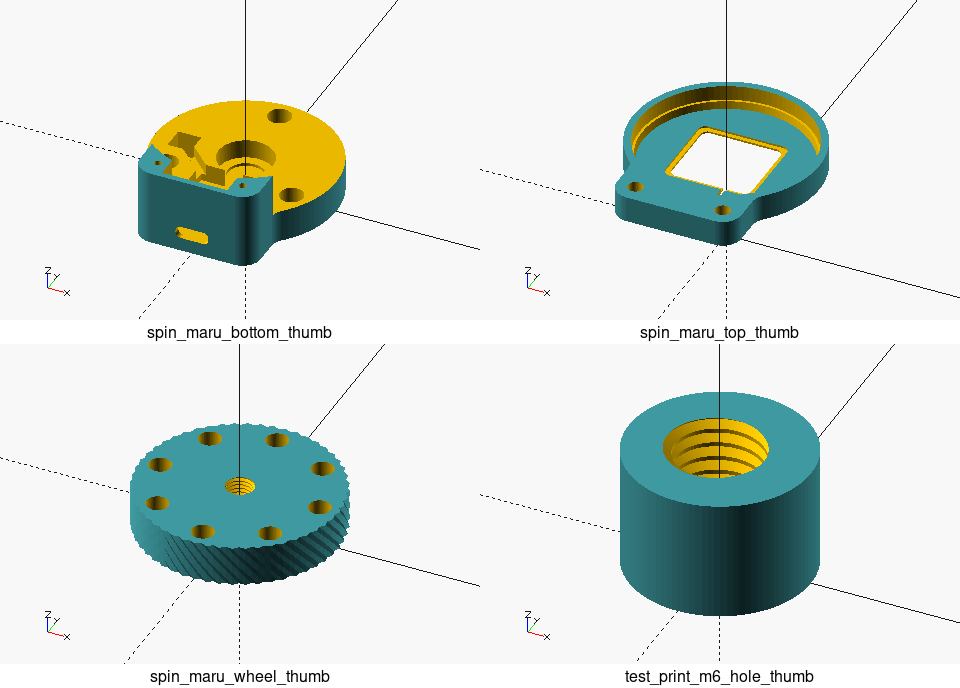

# spin-maru




A custom input device with a circular touchpad and a free-spinning scroll wheel.

- Cirque 35mm round touchpad module.
- Free-spinning wheel on a ball bearing, monitored by a high-resolution magnetic encoder (AS5600).
- QMK-based firmware with [high-resolution scrolling support](https://github.com/qmk/qmk_firmware/pull/24423).
- Customizable 3D Printed Enclosure designed in OpenSCAD.

## BOM

| Component                                                           | Quantity | Notes                                                                                                                                                  |
| :------------------------------------------------------------------ | :------- | :----------------------------------------------------------------------------------------------------------------------------------------------------- |
| Seeed XIAO RP2040                                                   | 1        |                                                                                                                                                        |
| Cirque GlidePoint Circle Trackpad 35mm Round SPI/I2C curved overlay | 1        | [TM035035-2024-003](https://www.mouser.com/ProductDetail/Cirque/TM035035-2024-003?qs=sGAEpiMZZMvPLCW7ruiZXgtxsIeIbq9%252BZVViMhwscRd7sxWD1ikxPA%3D%3D) |
| AS5600 Magnetic Rotary Encoder Module  (w/ magnet)                  | 1        | 23.5x22.5 mm                                                                                                                                           |
| 696ZZ Ball Bearing                                                  | 1        | [Eastern Seiko 15ST6B1.5](https://www.easternseiko.co.jp/products/product_j.html)                                                                      |
| 6 x 6 mm Tactile Switch                                             | 1        |                                                                                                                                                        |
| 5.5 mm Tungsten Lure Weight                                         | 8        | Zappu lure weight                                                                                                                                      |
| M2 x 8mm Self-tapping Screws                                        | 2        |                                                                                                                                                        |
| Anti-slip Sheet (Optional)                                          | 1        |                                                                                                                                                        |
| Φ3mm x 6mm Neodymium Magnets (Optional)                             | 3        |                                                                                                                                                        |
| Wire                                                                | -        |                                                                                                                                                        |
| LOCTITE                                                             | -        |                                                                                                                                                        |






## 3D Printed Parts

- All necessary STL and OpenSCAD files can be found in the [`./enclosure`](./enclosure/) directory.



## Firmware

- This device uses QMK firmware. Install [QMK CLI](https://docs.qmk.fm/cli) and set up the environment first.
- Firmware source: [likeablob/spin-maru](https://github.com/likeablob/qmk_firmware/tree/likeablob/spin-maru)

```sh
# Clone the firmware repository
$ git clone --depth 1 --recursive --shallow-submodules -b likeablob/spin-maru https://github.com/likeablob/qmk_firmware
$ cd qmk_firmware

# Put the XIAO RP2040 into bootloader mode the first time:
# Hold the BOOT button, press the RESET button, then release BOOT.
# Or, connect while holding BOOT. It should appear as a USB drive (RPI-RP2).
# If using Linux, you might need to mount it (e.g., using udisksctl):
# $ udisksctl mount -b /dev/disk/by-label/RPI-RP2
$ qmk flash -kb likeablob/spin_maru -km default

# For subsequent flashes:
# Double-click the bottom reset switch quickly to enter bootloader mode.
# Then, run the 'qmk flash' command again.
```

## License

MIT
