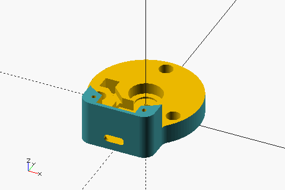
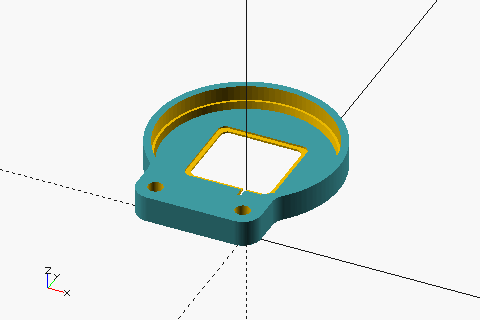
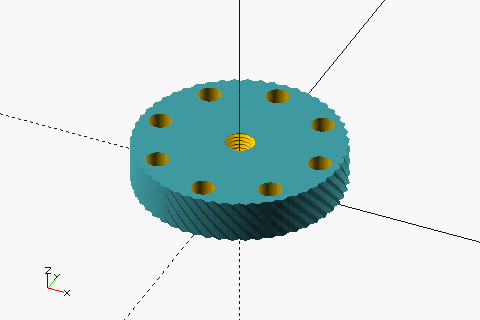
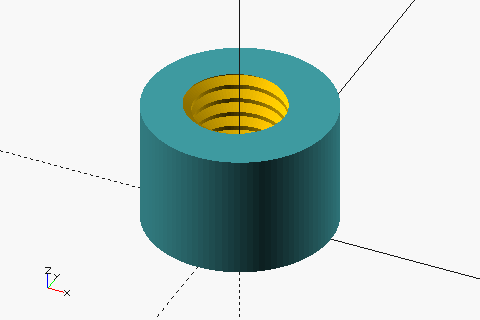

# spin-maru/enclosure

## Prerequisites

- OpenSCAD (nightly build) 2025.02
- GNU Make
- ImageMagick
- BOSL2 (included as a submodule)

## Build

```sh
$ git submodule update --init --recursive

# Generate .scad and .stl files.
$ make all -B

# Generate thumbnail images.
$ make images -B
```

## Parts

| Preview                                    | STL                                                |
| ------------------------------------------ | -------------------------------------------------- |
|    | [spin_maru_bottom.stl](./spin_maru_bottom.stl)     |
|       | [spin_maru_top.stl](./spin_maru_top.stl)           |
|     | [spin_maru_wheel.stl](./spin_maru_wheel.stl)       |
|  | [test_print_m6_hole.stl](./test_print_m6_hole.stl) |

## Print conditions

- 1.75mm PLA
- 0.2mm layer height
